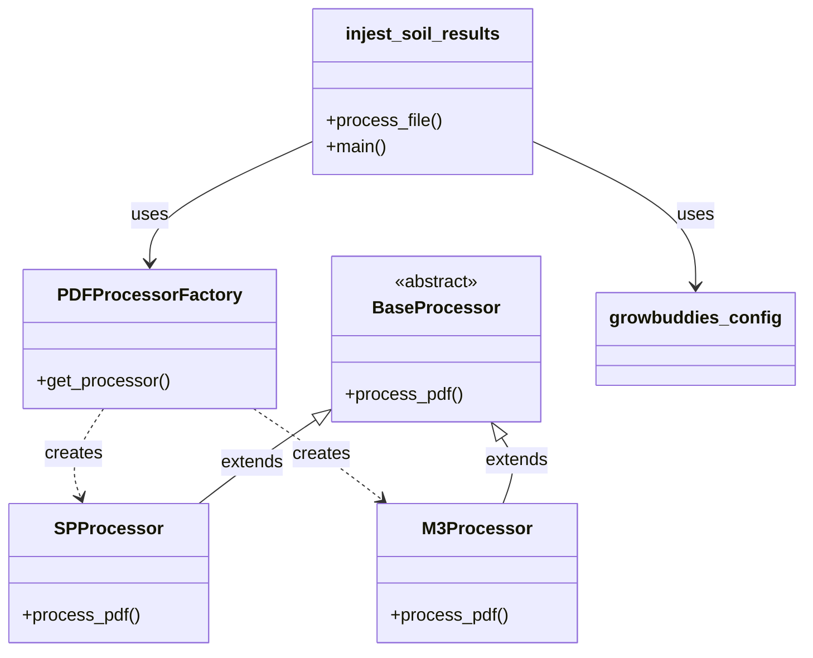
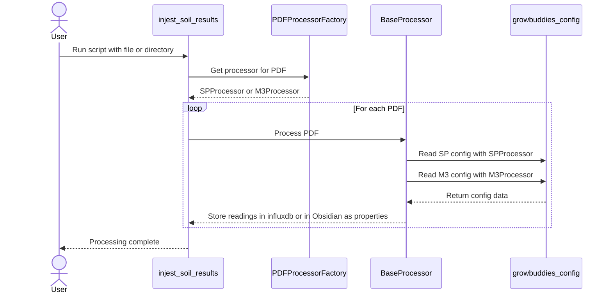

The `ingest_soil_reports` tool ingests PDF files from Logan Labs for Mehlich 3  or Saturated Paste Test reports into properties that can be stored as Obsidian YAML properties to be used with the Dataview plugin, or within an influxdb database.

This Dataview query shows the current available reports:

```dataview
LIST 
from #SP or #M3
SORT date
```
With the properties in Obisidian, we can use Dataview to view different aspects of the report.  For example, let;s look at the pH:
```dataview
TABLE pH
FROM #M3 
SORT date
```

What's nice about this is because these tables are built through a query, as more reports are added, the table picks them up.


## Code
The code is structured to process soil reports, with `injest_soil_results.py` serving as the entry point. This script is configured to process either individual or multiple PDF files containing soil data. It leverages the `PDFProcessorFactory` to determine the appropriate processing class for each PDF file. The factory has a method, `get_processor()`, that dynamically selects the correct processor based on the content within the PDF. The selection is between two specialized classes: `SPProcessor` and `M3Processor`.

The `SPProcessor` and `M3Processor` classes inherit from the abstract base class `BaseProcessor`, addressing the common behaviors of the tables within the PDFs  but allows the two inherited classes to implement specific behaviors for their respective soil report types. Each processor class has a `process_pdf()` method designed to handle the intricacies of its designated report format, ensuring that the data is accurately extracted and processed.

The entire processing operation is configured by settings defined in `growbuddies_config.py`, which `injest_soil_results.py` utilizes. This configuration includes  parameters that dictate how soil reports should be processed.
### Class Diagram

Walking through the diagram:
- `injest_soil_results` uses `PDFProcessorFactory` and `growbuddies_config`.
- `PDFProcessorFactory` has a method `get_processor()` which creates instances of either `SPProcessor` or `M3Processor`.
- Both `SPProcessor` and `M3Processor` extend from the abstract class `BaseProcessor`, which means they inherit its methods and properties.
- `BaseProcessor` is marked as abstract, indicating it provides a template for other processor classes and is not intended to be instantiated on its own.


### Sequence Diagram
The sequence diagram gives details of the flow of the API calls between the various Python scripts.
- The `User` starts the process by running the `injest_soil_results` script, providing either a file or directory as an argument.
- `injest_soil_results` then requests a processor from `PDFProcessorFactory` by calling `get_processor(pdf_file)`.
- The factory determines the appropriate processor type and returns an instance of either `SPProcessor` or `M3Processor` to `injest_soil_results`.
- For each PDF file, `injest_soil_results` calls `process_pdf()` on the `BaseProcessor`. Depending on the processor instance returned, either `SPProcessor` or `M3Processor` executes its `process_pdf()` method.
- The selected processor reads the necessary configuration from `growbuddies_config` during its processing.
- After processing, the processor returns control to `injest_soil_results`, indicating that processing is complete.
- Once all files are processed, `injest_soil_results` signals to the `User` that the processing is finished.




